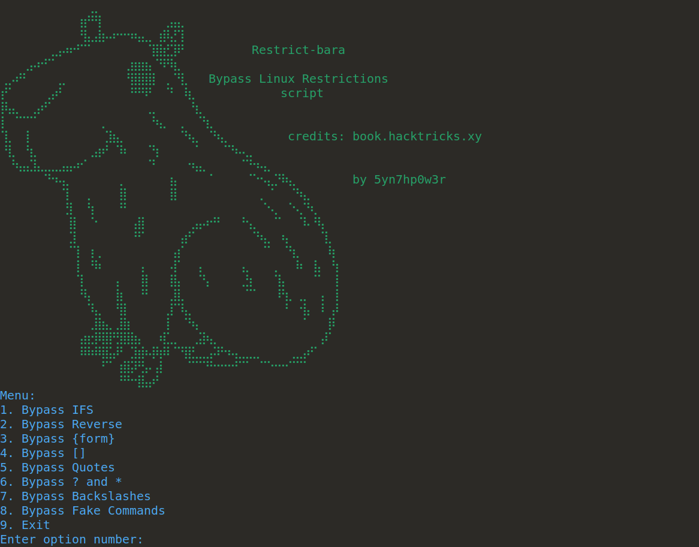
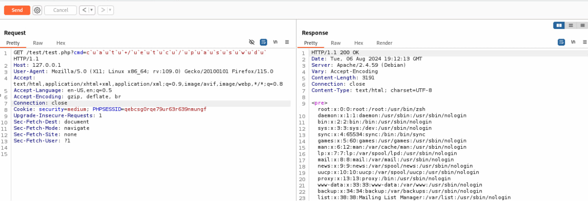

# Bypass Linux Restrictions script



**Disclaimer:**

> The author assumes no responsibility for any damage caused by this tool. Its primary purpose is to consolidate a variety of bypass methods into a single, convenient utility.
>
> **Please, only use it for legitimate purposes such as penetration testing or for educational purposes.**

---

## Script Description

This script automates the process of bypassing Linux terminal restrictions, allowing you to circumvent certain blacklist filters. It is important to combine methods to achieve the best results.

Credits:
https://book.hacktricks.xyz/linux-hardening/bypass-bash-restrictions

---
## Available Options

### 1. Bypass IFS
- **Description:**  
  The 'Bypass IFS' method allows bypassing the standard input field separators (IFS), which include spaces, tabs, and newlines. This is useful when you need to work with commands or inputs containing spaces.
- **Usage examples:**  
  It can be used with commands containing spaces or tabs, such as `ls -la` or `cat /etc/passwd`.
- **Example:**  
  To bypass spaces, you can use a construct like `ls -la` as `ls${IFS}-la`.

### 2. Bypass Reverse
- **Description:**  
  The 'Bypass Reverse' method allows you to reverse the input string and execute it in reverse order. This can be useful in scenarios where command processing is required in reverse order. (Bypass WAF, Blacklisting)
- **Usage examples:**  
  Suitable for commands like `whoami` or `cat /etc/passwd`, which will be executed in reverse.
- **Example:**  
  `(rev<<<'imaohw')|bash` will execute the command in reverse order.

### 3. Bypass `{form}`
- **Description:**  
  The 'Bypass `{form}`' method allows processing commands containing curly braces. This method is suitable for commands that may be in such a format.
- **Usage examples:**  
  Use commands, such as `cat /etc/passwd`, for checking or execution.
- **Example:**  
  The command `cat /etc/passwd` will be processed in curly brace format: `{cat,/etc/passwd}`.

### 4. Bypass `[]`
- **Description:**  
  The 'Bypass `[]`' method allows processing commands containing square brackets. This method can be useful for handling commands that include square brackets.
- **Usage examples:**  
  Enter only multiple commands, such as `cat /etc/passwd`, which will be processed with square brackets.
- **Example:**  
  The command `cat /etc/passwd` will be processed in square bracket format: `cat /e[t]c/p[a]s[s]w[d]` (Bypass WAF, Blacklisting)

### 5. Bypass Quotes
- **Description:**  
  The 'Bypass Quotes' method allows processing commands containing various quote bypass methods. This method is useful when commands contain quotes or other characters that require special handling.
- **Usage examples:**  
  Enter single commands, such as `whoami`, to test various quote bypass methods.
- **Example:**  
  The command `whoami` will be processed using various quote bypass methods. (Bypass WAF, Blacklisting)

### 6. Bypass `?` and `*`
- **Description:**  
  The 'Bypass `?` and `*`' method allows replacement of specific characters in the command with `?` or `*`. This can be used to evade filters that do not recognize these characters.
- **Usage examples:**  
  Commands like `ls -la` can be transformed to `ls ?la` or `ls *la` or `cat /et*/p*sswd` to bypass filters.
- **Example:**  
  For input `ls -la`, outputs will be `ls ?la` and `ls *la`.

### 7. Bypass Backslashes
- **Description:**  
  The 'Bypass Backslashes' method replaces backslashes in the command with alternative representations. This can help bypass filters that specifically target backslashes.
- **Usage examples:**  
  Commands containing backslashes like `cat /etc/passwd` can be altered.
- **Example:**  
  For input `cat /etc/passwd`, outputs might include:  
  `cat \/\e\t\c\/\p\a\s\s\w\d`

### 8. Bypass Fake Commands
- **Description:**  
  The 'Bypass Fake Commands' method involves creating fake commands or altering command names to avoid detection.
- **Usage examples:**  
  Commands like `whoami` can be transformed into:
  ```bash
  w`u`h`u`o`u`a`u`m`u`i`u`


## Examples:
  **ModSecurity and the latest OWASP CRS:**

